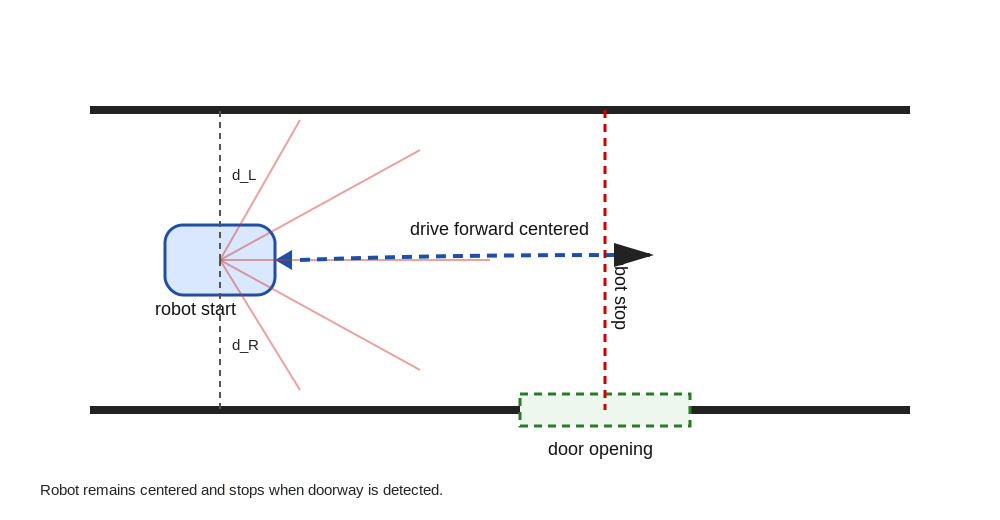

# Report III — Corridor Centering and Doorway Detection
Authors: Martijn Spaepen, Richard Nollet, Maxime Van Insberghe

---

## 1. Introduction

The goal of this project is to design an improvement in the robot’s control software that allows it to navigate through a corridor while maintaining a central position and detecting door openings. It's an effort to implement a feasible level of autonomy on the platform. 

## 2. Task Description

The robot starts inside a corridor-like environment and performs the following task:

1. Move forward while staying centered between two walls  
2. Continuously monitor free space on both sides  
3. Detect a doorway (opening in the wall)  
4. Stop when a valid doorway is detected  

## 3. World Model

### 3.1 Extracted Features from LIDAR

From raw LIDAR data (270° scan), we compute:

- `d_L`: distance to left wall  
- `d_R`: distance to right wall  
- `e = d_L - d_R`: lateral offset  
- Opening detection:
  - sudden increase in `d_L` or `d_R`

### 3.2 Asynchronous Update

The world model is updated continuously and asynchronously:

- LIDAR processing runs at sensor frequency  
- Control runs at actuator frequency  

Perception is therefore independent of the task FSM.

## 4. Software Architecture

The system consists of four asynchronous activities:

1. **Sensor Processing**
   - Converts LIDAR data into features  

2. **World Model Update**
   - Maintains corridor structure  

3. **Control Loop**
   - Computes velocity commands  

4. **Task FSM**
   - Switches between manoeuvres  

The FSM is only responsible for task-level decisions and does not coordinate perception or control.

## 5. Task FSM

### State 1: Corridor Following
- Maintain central position  
- Monitor for openings  

### State 2: Door Detected
- Stop robot  

## 6. Detailed Control Design (State 1)

### 6.1 Control Objective

The robot should stay centered in the corridor:

e = d_L - d_R → 0

### 6.2 Control Loop Structure

We use a closed-loop velocity controller:

- Input: lateral error `e`  
- Output: angular velocity `ω` 
  
Note: The angular velocity ω represents the rotational velocity of the robot platform around its vertical axis, not the velocity of an individual wheel. The controller applies a rotational correction.

Control law:

ω = -K_p * e

Forward velocity:

v = v_0 (constant)

### 6.3 Limitations

- Assumes corridor-like structure  
- No memory (No occupancy maps, instantaneous model only)  

## 7. Door Detection Mechanism

A doorway is detected when:

- `d_L > d_threshold` or `d_R > d_threshold`

