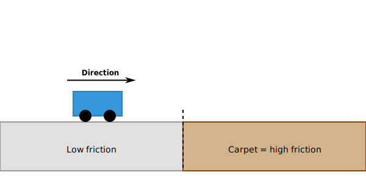

report of Maxime Van Insberghe, Richard Nollet, Martijn

## experiment setup

This experiment investigates the system's response to a step-change in friction. The robot transitions from a smooth, low-friction surface to a high-friction surface (e.g., carpet). This setup allows us to observe how a velocity or a torque controller handles a sudden increase in external resistance torque without physical impact or mechanical changes to the robot itself.

## experiment expectations
# velocity control

When the robot is driving on the smooth surface and the desired speed is reached, the current settles to a steady-state value that provides enough torque to balance the low friction. At this stage, the generated torque is just sufficient to counteract the minimal rolling resistance and internal friction.

When the robot reaches the carpet, the friction will suddendly increase. Since the controller is tasked with maintaining a constant angular velocity, it detects an immediate drop in speed (the velocity error). In response, the feedback loop initiates a large current spike to provide the necessary torque to overcome this new load and re-accelerate the wheels. Once the target speed is recovered, the current settles at a new steady-state equilibrium.

Because of the sudden change in fricton, there will be a small dip in speed.